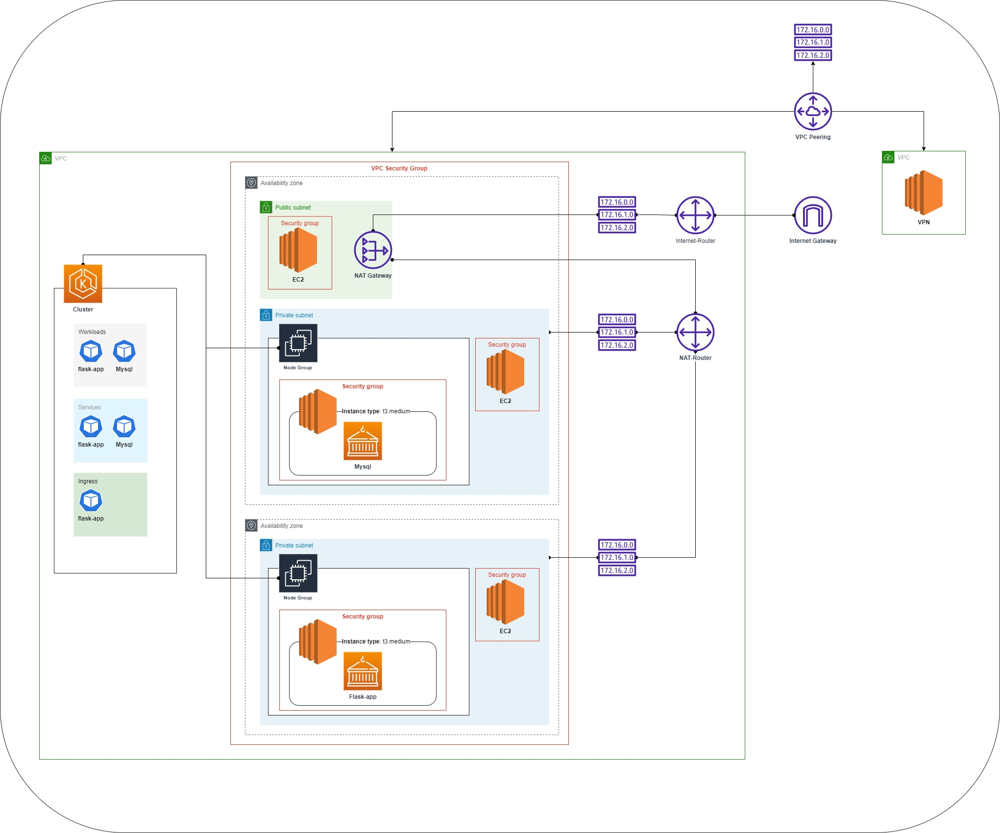

## This is a small project using Terrafrom, Helm, Docker, minikube, Jenkins, Python, AWS etc ...

Here we deploy a VPC with One public subnet, Two private subnets, NAT, ING, VPC peering, k8s cluster and  microservice architecture application with mysql DB. 



## Build
```shell
$ pip freeze > requirements.txt
$ python main.py
$ docker image build -t flask-app .
$ docker run --name flask-app -p 8082:8082 -d flask-app
$ minikube image load flask-app
```

## Deploy

```shell
$ kubectl create namespace dimitar --dry-run=client -o yaml | kubectl apply -f -
$ helm install flask-app app_mysql -n dimitar
$ kubectl get pod -n dimitar
$ kubectl log flask-app-214245 -n dimitar
$ kubectl port-forward service/flask-app-service 8080:8080 -n dimitar
$ minikube addons enable ingress
$ kubectl get ing -n dimitar
```
## Mysql

```shell
$ kubectl exec --stdin --tty mysql-1234325 -- /bin/bash
$ mysql -pip
$ SHOW SCHEMAS;
$ SHOW DATABASES;
```

or 

```shell
$ kubectl port-forward flask-app-mysql-12413444314 3306:3306 -n dimitar
$ SHOW SCHEMAS;
$ SHOW DATABASES;
```
